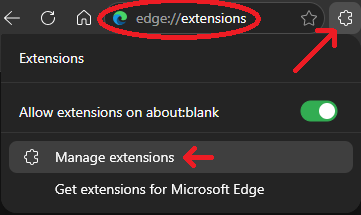
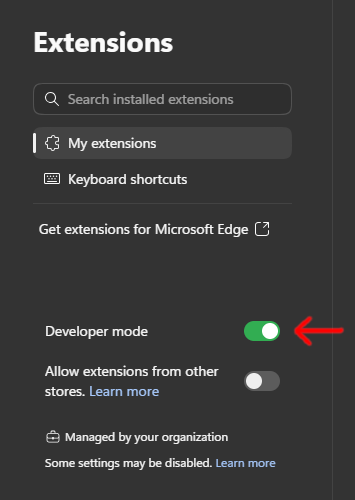
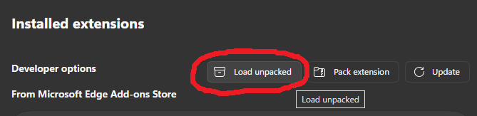
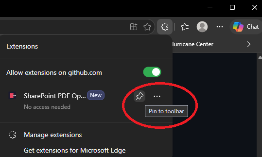
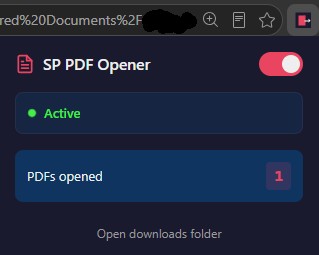
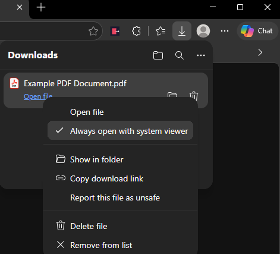

# SharePoint PDF Opener

> Automatically opens SharePoint PDF files in Adobe Acrobat — bypassing the browser viewer entirely.

Tired of SharePoint's slow, clunky online PDF viewer? This lightweight browser extension intercepts PDF link clicks on SharePoint, downloads the file using your existing browser authentication, and hands it off to Adobe Acrobat via Windows file association. The result: PDFs open in **~4 seconds** instead of the usual **~10 seconds** of waiting for the web viewer to load.

No services. No registry entries. No startup items. Just a browser extension that works.

## How It Works

```
┌──────────────────┐      ┌───────────────────┐      ┌──────────────────┐      ┌──────────────────┐
│  User clicks a   │      │  Content script   │      │  Background.js   │      │  Windows opens   │
│  PDF link on     │----->│  intercepts the   │----->│  downloads via   │----->│  the file in     │
│  SharePoint      │      │  click event      │      │  browser auth    │      │  Adobe Acrobat   │
└──────────────────┘      └───────────────────┘      └──────────────────┘      └──────────────────┘
```

1. **Click** — You click any PDF link on `*.sharepoint.com`
2. **Intercept** — The content script captures the click before SharePoint's viewer loads
3. **Download** — The background script downloads the PDF using your existing browser session (no extra login)
4. **Open** — Windows opens the downloaded file in Adobe Acrobat via file association

## Installation

### Prerequisites

- **Microsoft Edge** (Chromium-based) or **Google Chrome**
- **Adobe Acrobat** set as the default PDF handler in Windows
  - Check: **Windows Settings → Default apps → `.pdf`** → should show Adobe Acrobat

### Step 1: Download the Extension

Clone this repository or download as ZIP and extract:

```bash
git clone https://github.com/wayabovetharim/sharepoint-pdf-opener.git
```

### Step 2: Load in Edge

1. Navigate to `edge://extensions`

   

2. Enable **Developer mode**

   

3. Click **Load unpacked**

   

4. In the folder picker dialog, navigate to where you cloned/extracted this repository and select the **`extension`** subfolder (not the root repo folder). For example:
   ```
   sharepoint-pdf-opener/
   ├── extension/   ◄── select this folder
   ├── images/
   ├── README.md
   └── LICENSE
   ```

### Step 3: Pin the Extension (Optional)

Click the extensions puzzle piece icon in the toolbar → pin **"SharePoint PDF Opener"**



### Step 4: Enable Auto-Open (One-Time)

Click the extension icon to confirm it's active — you should see the green status indicator and PDF counter:



Now click your first PDF on SharePoint. The extension will intercept and download it. Then:

1. Look in Edge's download tray
2. Click the `⋯` menu on the downloaded PDF
3. Select **"Always open with system viewer"**

   

This tells Edge to auto-open **ALL** future PDF downloads in Acrobat.

## Features

- **SharePoint-only interception** — Content script scoped to `*.sharepoint.com`
- **Click interception** — Captures PDF link clicks before SharePoint's viewer loads
- **URL detection** — Handles `AllItems.aspx?id=...pdf`, WopiFrame viewer, sharing links
- **SPA-aware** — Monitors URL changes in SharePoint's single-page app
- **Automatic cleanup** — Old downloads purged every 24 hours
- **Enable/disable toggle** — Click the extension icon to pause
- **PDF counter** — Tracks how many PDFs you've opened
- **Zero footprint** — No services, no registry, no startup entries

## How Each Requirement Is Met

| Requirement | Solution |
|---|---|
| Auto-start after boot | Extension activates with browser — always on |
| Survive Win+L lock/unlock | Browser stays running — extension unaffected |
| Invisible to user | No popups, no tray icons, no notifications |
| SharePoint-only | Permissions and scripts scoped to `*.sharepoint.com` |
| Temp download | Downloads to `Downloads/SharePointPDFs/`, auto-cleaned |
| Faster than manual | ~4s vs ~10s — intercepts before viewer loads |

## Chrome Support

This extension works in Google Chrome as well:

1. Navigate to `chrome://extensions`
2. Enable **Developer mode**
3. Click **Load unpacked** → select the `extension` folder

## Uninstalling

- Go to `edge://extensions` → Remove **"SharePoint PDF Opener"**
- No registry entries, services, or startup items to clean up
- Optionally disable "Always open with system viewer" in Edge download settings

## Troubleshooting

**PDF downloads but doesn't open in Acrobat:**
- Ensure "Always open with system viewer" is enabled ([Step 4](#step-4-enable-auto-open-one-time) above)
- Check **Windows Settings → Default apps → `.pdf`** → should be Adobe Acrobat

**Extension doesn't intercept on SharePoint:**
- Click the extension icon and verify the toggle shows "Active"
- Reload the SharePoint page
- Check that the URL contains `.sharepoint.com`

**Developer mode warning:**
- Edge shows a periodic warning about developer mode extensions
- Click **"Remind me in 2 weeks"** — the extension works normally regardless

## License

[MIT](LICENSE)
